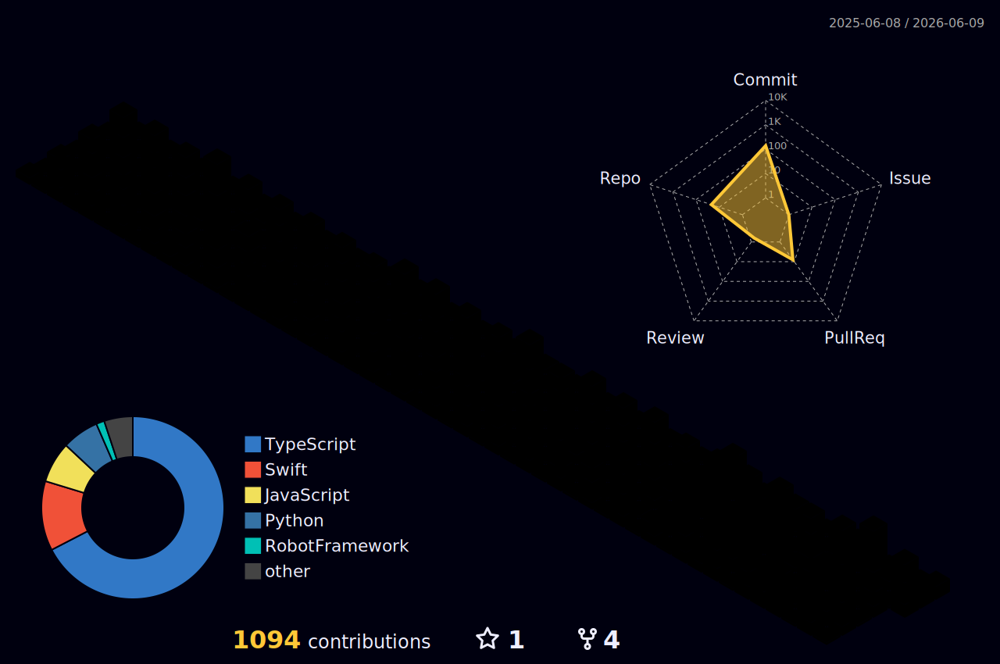

<!-- 💻 GitHub Stats and 🔥 Github Streaks side by side with vertical line -->
<p align="center">
  <a href="#"></a>
  <span style="border-left: 2px solid #ddd; height: 192px; margin: 0 20px;"></span>
  <a href="https://git.io/streak-stats"></a>
</p>


<!--Squirel Image-->


<p align="center">
  
</p>

<!-- 💻 GitHub Stats and 🔥 Github Streaks side by side with headings and vertical line -->

<div align="center">
  <div style="display: inline-block; margin-right: 20px;">
    <h2>GitHub Stats</h2>
    <a href="#">
      
    </a>
  </div>
  <div style="display: inline-block; border-left: 2px solid #ddd; padding-left: 20px;">
    <h2>Github Streaks</h2>
    <a href="https://git.io/streak-stats">
      
    </a>
  </div>
</div>

[](https://github.com/miracneroid/github-readme-activity-graph)

<!--   <b>Note:</b> <i>Top languages is only a metric of the languages my public code consists of and doesn't reflect experience or skill level.</i> -->
</p>

<p align="center">
<br/>
<a href="https://www.linkedin.com/in/miracneroid">
  
</a>
<a href="https://open.spotify.com/user/11147618695?si=zZFn6uAGRLyoU02lsG50GA">
  
</a>
<br>
</p>

<p align="center">
  
</p>


<p align="center" >
  <a href="https://github.com/yogeshwaran01/github-stats-terminal-style/actions/workflows/main.yml">
    
  </a>
</p>

<p align='center'>
  
</p>

<p align="center">
  
</p>

<p align="center">
  
</p>


**:zap: Recent Activity:**

<!--START_SECTION:activity-->
1. 🎉 Merged PR [#65](https://github.com/miracneroid/TrackDrop/pull/65) in [miracneroid/TrackDrop](https://github.com/miracneroid/TrackDrop)
2. 💪 Opened PR [#65](https://github.com/miracneroid/TrackDrop/pull/65) in [miracneroid/TrackDrop](https://github.com/miracneroid/TrackDrop)
3. 🗣 Commented on [#131](https://github.com/APLA-Toolbox/PythonPDDL/issues/131#issuecomment-1842782562) in [APLA-Toolbox/PythonPDDL](https://github.com/APLA-Toolbox/PythonPDDL)
4. 🗣 Commented on [#36](https://github.com/miracneroid/miracneroid/issues/36#issuecomment-1829219514) in [miracneroid/miracneroid](https://github.com/miracneroid/miracneroid)
5. 🗣 Commented on [#25](https://github.com/miracneroid/miracneroid/issues/25#issuecomment

-1829210546) in [miracneroid/miracneroid](https://github.com/miracneroid/miracneroid)
<!--END_SECTION:activity-->


<!--START_SECTION:waka-->


**🐱 My GitHub Data** 

> 📦 334.4 kB Used in GitHub's Storage 
 > 
> 🏆 103 Contributions in the Year 2024
 > 
> 💼 Opted to Hire
 > 
> 📜 55 Public Repositories 
 > 
> 🔑 12 Private Repositories 
 > 
**I'm a Night 🦉** 

```text
🌞 Morning                279 commits         █░░░░░░░░░░░░░░░░░░░░░░░░   04.20 % 
🌆 Daytime                2228 commits        ████████░░░░░░░░░░░░░░░░░   33.55 % 
🌃 Evening                3069 commits        ████████████░░░░░░░░░░░░░   46.22 % 
🌙 Night                  1064 commits        ████░░░░░░░░░░░░░░░░░░░░░   16.02 % 
```


📊 **This Week I Spent My Time On** 

```text
🕑︎ Time Zone: Asia/Dubai

💬 Programming Languages: 
Python                   5 hrs 36 mins       ██████████████░░░░░░░░░░░   57.68 % 
C++                      3 hrs 22 mins       █████████░░░░░░░░░░░░░░░░   34.65 % 
JSON                     16 mins             █░░░░░░░░░░░░░░░░░░░░░░░░   02.90 % 
YAML                     13 mins             █░░░░░░░░░░░░░░░░░░░░░░░░   02.34 % 
C                        13 mins             █░░░░░░░░░░░░░░░░░░░░░░░░   02.26 % 

🐱‍💻 Projects: 
pid_suite                5 hrs 19 mins       ██████████████░░░░░░░░░░░   54.71 % 
swarm_mission            4 hrs 13 mins       ███████████░░░░░░░░░░░░░░   43.47 % 
netbox-swarm-gui         4 mins              ░░░░░░░░░░░░░░░░░░░░░░░░░   00.81 % 
swarm_uav_control_ros2   2 mins              ░░░░░░░░░░░░░░░░░░░░░░░░░   00.37 % 
swamp_netbox_bridge      1 min               ░░░░░░░░░░░░░░░░░░░░░░░░░   00.21 % 
```


 Last Updated on 15/02/2024 12:31:13 UTC
<!--END_SECTION:waka-->

<!--START_SECTION:waka-simple-->

```text
From: 16 July 2020 - To: 13 February 2024

Total Time: 1,585 hrs 18 mins

C++                544 hrs 36 mins ⣿⣿⣿⣿⣿⣿⣿⣿⣶⣀⣀⣀⣀⣀⣀⣀⣀⣀⣀⣀⣀⣀⣀⣀⣀   34.35 %
Go                 313 hrs 18 mins ⣿⣿⣿⣿⣿⣀⣀⣀⣀⣀⣀⣀⣀⣀⣀⣀⣀⣀⣀⣀⣀⣀⣀⣀⣀   19.76 %
Python             214 hrs 46 mins ⣿⣿⣿⣤⣀⣀⣀⣀⣀⣀⣀⣀⣀⣀⣀⣀⣀⣀⣀⣀⣀⣀⣀⣀⣀   13.55 %
C                  126 hrs 24 mins ⣿⣿⣀⣀⣀⣀⣀⣀⣀⣀⣀⣀⣀⣀⣀⣀⣀⣀⣀⣀⣀⣀⣀⣀⣀   07.97 %
Bash               82 hrs 46 mins  ⣿⣤⣀⣀⣀⣀⣀⣀⣀⣀⣀⣀⣀⣀⣀⣀⣀⣀⣀⣀⣀⣀⣀⣀⣀   05.22 %
YAML               73 hrs 4 mins   ⣿⣄⣀⣀⣀⣀⣀⣀⣀⣀⣀⣀⣀⣀⣀⣀⣀⣀⣀⣀⣀⣀⣀⣀⣀   04.61 %
```

<!--END_SECTION:waka-simple-->


Liked it ?

<h3 align="left">Connect with me:</h3>
<p align="left">
<a href="https://linkedin.com/in/diptendu som" target="blank"></a>
<a href="https://instagram.com/ds._piku" target="blank"></a>
<a href="https://www.hackerrank.com/@diptendusom" target="blank"></a>
</p>

*ERC-20 / EVM: **0x07ed706146545d01fa66a3c08ebca8c93a0089e5***

*BTC: **bc1q3lu85cfkrc20ut64v90y428l79wfnv83mu72jv***



<div align="center">  
  
  <p>Thank you for visiting!</p>
</div>

<p align="center">
  
</p>


