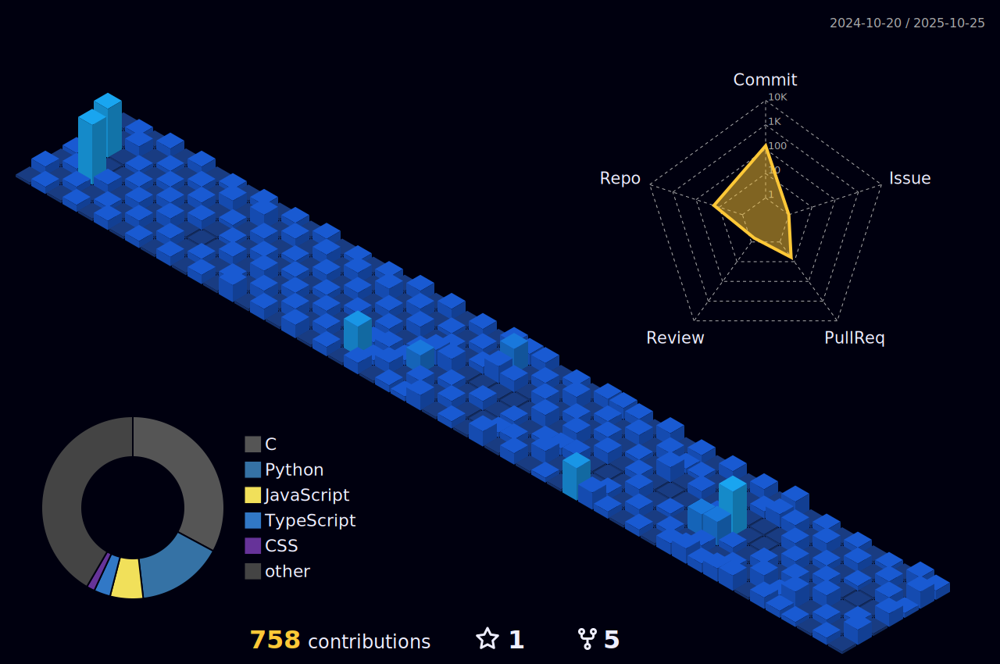

<!--Squirel Image-->

<!-- Profile Header -->
<h1 align="center">Hi 👋, I'm miracneroid</h1>

  

  Passionate about Robotics 🤖 | AI 🤯 | Cloud ☁️ | DevOps ⚡ | Fullstack 🧑‍💻

---

<h2 align="center">🔥 GitHub Stats</h2>

  
  

---

### 🛠️ Languages and Tools

#### Frontend

  
  
  
  
  
  
  
  
  

#### Backend & Cloud

  
  
  
  
  
  
  
  
  
  

#### Data Science & AI

  
  
  
  
  
  
  
  

#### DevOps & Tools

  
  
  
  
  

---

---

### 🔗 Connect with me

  
  
  
  
  
  
  
  
  
  
  
  
  
  
  
  
  
  
  

---

  
  
  
Thank you for visiting!

  

