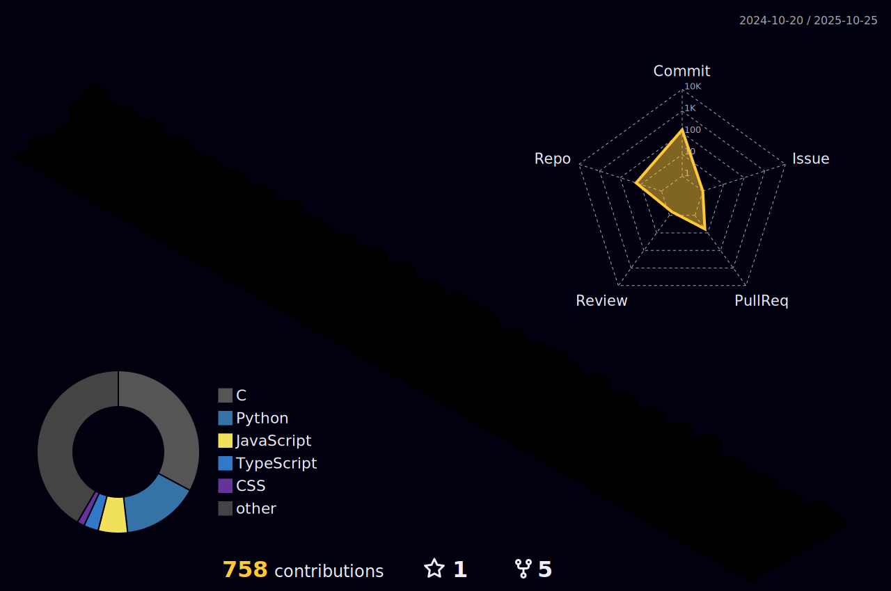

<!--Squirel Image-->

  

<!-- 💻 GitHub Stats and 🔥 Github Streaks side by side -->

  <h2>🔥 GitHub Stats</h2>
  

  
  

  

  

<h3 align="left">Connect with me:</h3>

  
  
  
Thank you for visiting!

  

